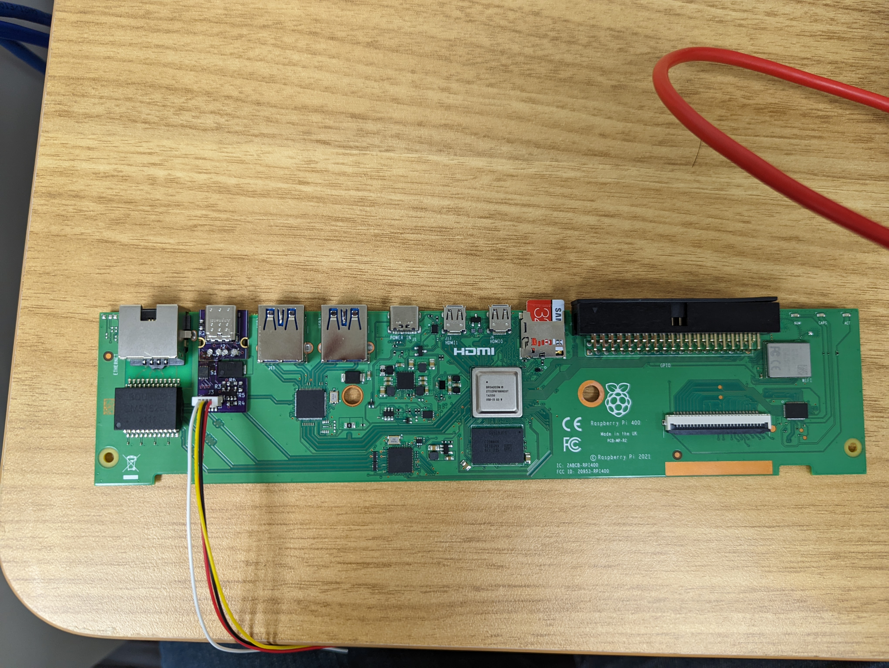
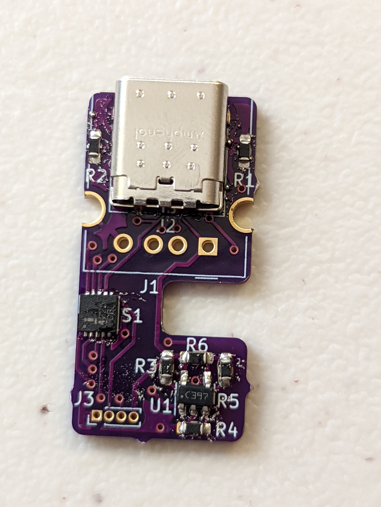
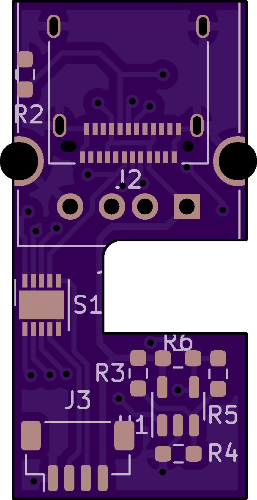
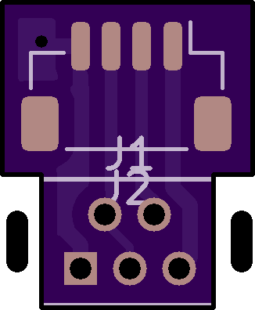

'Raspberry Pi 468' PCB files
---

This repo contains the PCB model files for the RPi 468
For more details, see my blog post here: [pvphan.com](pvphan.com)

The USB host switching circuit solder in place of the Raspberry Pi 400 USB-A 2.0 port

The USB host switching circuit, mostly soldered

Profile of USB host switching circuit

Profile of Mini USB to JST bridge

